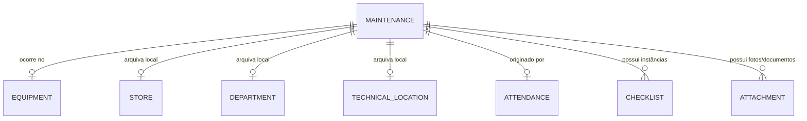

# Plano de Análise de Domínio - Fase 9.1 (Manutenções)

## 1. Situação Atual
A entidade base para manutenções (`MaintenanceRecord`) já existe na arquitetura atual (MVP), possuindo roteador (`maintenances.py`), frontend (`MaintenancePage.tsx`) operante e integrações básicas. O modelo atual já atende o fluxo básico:
- Criação e atualização de manutenções preventivas e corretivas.
- Status (agendada, em_andamento, concluida).
- Vínculo obrigatório com `Equipment` e opcional com `Store`.
- Geração automática de log no `EquipmentHistory` ao concluir.
- Integração de `Checklist` e `ChecklistItem` associados ao ID da manutenção.
- Suporte a anexos usando a funcionalidade global de `Attachment` (onde `entity_type = "maintenance"`).

## 2. Problemas Encontrados (Lacunas da Arquitetura)
Ao analisar o escopo para a Fase 9, as seguintes deficiências foram mapeadas:
1. **Perda de Contexto Físico Meticuloso:** O `MaintenanceRecord` grava o `store_id`, mas não grava o `department_id` ou o `technical_location_id`. Como equipamentos se movem, o histórico da manutenção não preserva a exata localização física no momento em que ocorreu.
2. **Ausência de Amarração OTRS:** Diferente de `Attendance`, a manutenção não prevê um campo `otrs_reference`, impossibilitando o rastreio da OS de campo caso tenha sido formalizada no OTRS.
3. **Ausência de Relação com Attendance:** Muitas manutenções corretivas nascem de um Atendimento Interno de software/rede que evoluiu para falha de hardware. Não há como vincular (ex: "Manutenção gerada a partir do Atendimento #123").
4. **Materiais/Peças:** Não existe como listar ordenadamente peças trocadas (o que é vital para justificar custos), possuindo apenas um campo `cost`.
5. **Checklists Fixos/Frontend:** Atualmente, o frontend está mandando um array hardcoded (`['Limpeza...', 'Inspeção...']`) na criação da manutenção, pois não há um sistema de Templates no backend.

## 3. Requisitos Funcionais
- Operacionalizar manutenções preventivas (agendadas via calendário), corretivas (provenientes de falhas) e emergenciais.
- A localização (Store, Department, Tech Location) do equipamento deve ser "congelada" no registro da manutenção ao ser criada/iniciada.
- Informar e rastrear se a manutenção consumiu insumos via campo textual descritivo.
- Organizar e instanciar listas de checagem padronizadas (Templates).
- Dispor as manutenções visualmente num calendário.

## 4. Regras de Negócio e Diferenciações
- **Manutenção vs Atendimento (Attendance):**
  - *Attendance* = Registro de Service Desk. Auxílio remoto, software, dúvidas, redefinição de senha ou análise inicial de um defeito.
  - *Maintenance* = Intervenção de infraestrutura ou hardware. Limpeza, troca de componentes físicos, cabeamento pesado estruturado.
- **Relação com OTRS:** O OTRS não será integrado via API neste momento para manutenções, mas a Central servirá como sistema de apoio. Se a equipe de TI abriu uma OS no OTRS, ela apenas anota a string do ticket.
- **Checklists:** Não criaremos instâncias repetidas para cada item toda vez sem necessidade. Um "Template" vai servir de gabarito e será copiado (instanciado) para dentro da manutenção na hora da execução.
- **Estado do Equipamento:** Se a manutenção vai para `em_andamento`, a automação atual que muda o equipamento para `em_manutencao` será mantida rigorosamente.

## 5. Modelo de Dados Proposto
Modificações na tabela `maintenance_records` via Alembic:
- Adicionar `department_id` (FK nula, para setor).
- Adicionar `technical_location_id` (FK nula, para local técnico).
- Adicionar `attendance_id` (FK nula, para Attendance).
- Adicionar `otrs_ticket` (String, limite 64).
- Adicionar `parts_used` (Text, descrever livremente as peças/materiais utilizados, como "1x Cooler 120mm, Pasta térmica", fugindo da necessidade de um ERP de estoque agora).

Nova Tabela `checklist_templates` e `checklist_template_items`:
- `id`, `name`, `maintenance_type` (default "preventiva").
- Itens predefinidos que o frontend chamará ao carregar.

## 6. Relacionamentos

## 7. API
- `/maintenances`: Refatoração dos schemas (Pydantic) para aceitarem os novos campos (`otrs_ticket`, `parts_used`, `attendance_id`).
- `/checklist-templates`: Novo CRUD para que gestores definam as listas padrão que os técnicos vão usar.

## 8. Frontend
- A `MaintenancePage.tsx` precisa de um refatoramento no formulário (Drawer ou modal componentizado) devido à quantidade de campos propostos.
- Criação de uma *View Mode* estilo "Calendar" ao lado de "List", renderizando o campo `scheduled_date` como caixas (ex: `FullCalendar` simplificado).
- Módulo de gerenciamento de templates nas configurações do sistema.

## 9. Estados (Status)
Mantêm-se: `agendada`, `em_andamento`, `concluida`, `cancelada`.
Regra: Status da manutenção comanda o status do equipamento.

## 10. Permissões e Auditoria
- Interceptações no `AuditLog` já operam no modelo atual, só precisamos garantir que os templates de checklist também sejam auditados caso alterados.
- Técnicos podem editar o que está atribuído a eles (`technician_id`).

## 11. Calendário (Calendar)
Para manter a simplicidade e leveza, o calendário não precisa de tabelas novas. É apenas um componente UI que recebe `GET /maintenances?status=agendada,em_andamento` e plota em `scheduled_date`.

## 12. Relação com OTRS
Mantém a regra arquitetural definida no início: `OTRS = chamado oficial`. A Central armazena a string do chamado do OTRS e foca em abrigar fotos anexas, peças utilizadas e o checklist de limpeza, dados que apenas fariam lixo na thread oficial do OTRS.

## 13. Complexidade e Riscos
- **Risco Alto:** Componentizar adequadamente o form de criação/edição. Se ficarem muitos campos obrigatórios, os técnicos vão odiar usar o sistema.
- **Mitigação:** Campos como peças, OTRS, Attendance, Custo, Resultados, devem ser opcionais (`nullable=True`). Apenas `title`, `equipment`, `type` e `status` são mandatórios.
- **Complexidade:** Média, pois a espinha dorsal já existe, focando apenas em adições pontuais e features de visualização (calendário e templates).

## 14. O Que Implementar na Fase 9
- Novas colunas de banco via Alembic (`department_id`, `technical_location_id`, `parts_used`, `otrs_ticket`, `attendance_id`).
- CRUD de `ChecklistTemplate` e `ChecklistTemplateItem`.
- View de Calendário no frontend.
- Refatorar criação de Manutenção para puxar o ID de um Template ou criar vazio.
- Integração de `Maintenance` com `Attendance` (botão de escalar Atendimento para Manutenção).

## 15. O Que Deixar para Fases Futuras
- Integração física bidirecional via API REST com OTRS (criar ticket no OTRS direto pela central).
- Sistema ERP de estoque atrelado a financeiro. O campo `parts_used` cumpre a função provisoriamente.
- App Mobile para preencher checklists de manutenção offline.

## 16. Validação Arquitetural 9.1.1
Após revisão minuciosa do plano arquitetural original, as seguintes decisões foram validadas e refinadas para a implementação:

1. **Snapshot de Localização:** O uso das chaves estrangeiras (`department_id` e `technical_location_id`) no `MaintenanceRecord` foi validado. Devido à arquitetura de *soft delete* implementada na Fase 8, esses registros não serão excluídos fisicamente do banco de dados se o equipamento mudar de local; eles permanecerão apontando para o local histórico. Não será necessário duplicar os nomes como strings de snapshot, as IDs são suficientes e preservam o contexto.
2. **Status do Equipamento:** A regra foi refinada para lidar com concorrência. Quando *qualquer* manutenção passa para `em_andamento`, o equipamento vai para `em_manutencao`. Contudo, ao concluir ou cancelar uma manutenção, o sistema deve varrer se existem **outras manutenções ativas** (`em_andamento`) para aquele equipamento. Se existirem, o equipamento permanece `em_manutencao`. Se não, ele retorna para o status `ativo`. Isso blinda o sistema contra estados incorretos em manutenções concorrentes.
3. **Attendance (Atendimentos):** Confirmada a independência dos domínios. Uma manutenção pode existir sem Atendimento, e vice-versa. O fluxo de "Escalar para Manutenção" no frontend apenas criará uma nova manutenção vinculando o `attendance_id`, deixando o ticket de Attendance intacto.
4. **Peças Utilizadas (`parts_used`):** Confirmado que o campo será puramente descritivo (texto) para justificar a intervenção, sem gatilhos com tabela `StockItem` ou movimentos de estoque. O escopo atual não é um ERP.
5. **Checklist Template:** Reafirma-se o fluxo de herança. A tabela `ChecklistTemplate` fornecerá um gabarito imutável durante a criação. Uma vez instanciado dentro da manutenção (`Checklist` e `ChecklistItem`), o técnico opera sobre uma cópia (instância local). Alterar o template padrão posteriormente não alterará as manutenções do passado. A ordem será garantida por um campo `position`.
6. **Calendário:** Selecionada a estratégia A (Visualização). Não duplicaremos a manutenção criando um `CalendarEvent`. O calendário no frontend agregará os dados realizando buscas paralelas tanto na API de `CalendarEvent` quanto na API de `/maintenances?status=agendada,em_andamento`, evitando dessincronização de dados caso uma manutenção seja reagendada ou cancelada.
7. **OTRS:** Ratificado. `MaintenanceRecord` só terá um campo `otrs_reference`. Nenhuma duplicação de SLAs ou fechamento no OTRS, tratando-se apenas de referência cruzada.
8. **Attachments (Anexos):** A entidade `Attachment` com `entity_type = "maintenance"` atende inteiramente o domínio de fotos e laudos sem necessidade de uma tabela própria.
9. **Auditoria:** O `AuditLog` interceptará criação, alteração de status (para em_andamento, concluida), exclusão de manutenção e edições em `ChecklistTemplate`. 
10. **Permissões:** 
    - **Técnico:** Pode criar manutenções, alterar status (iniciar, concluir), preencher checklists, e editar detalhes *se* for o técnico responsável ou se estiver sem técnico. Não pode excluir, nem gerenciar os Templates de Checklist.
    - **Gestor/Admin:** Pode tudo, incluindo exclusão, reatribuição e gestão de `ChecklistTemplate`.
